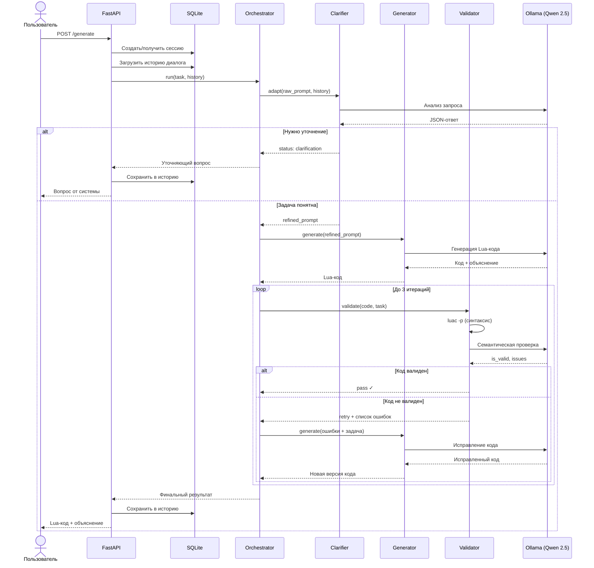
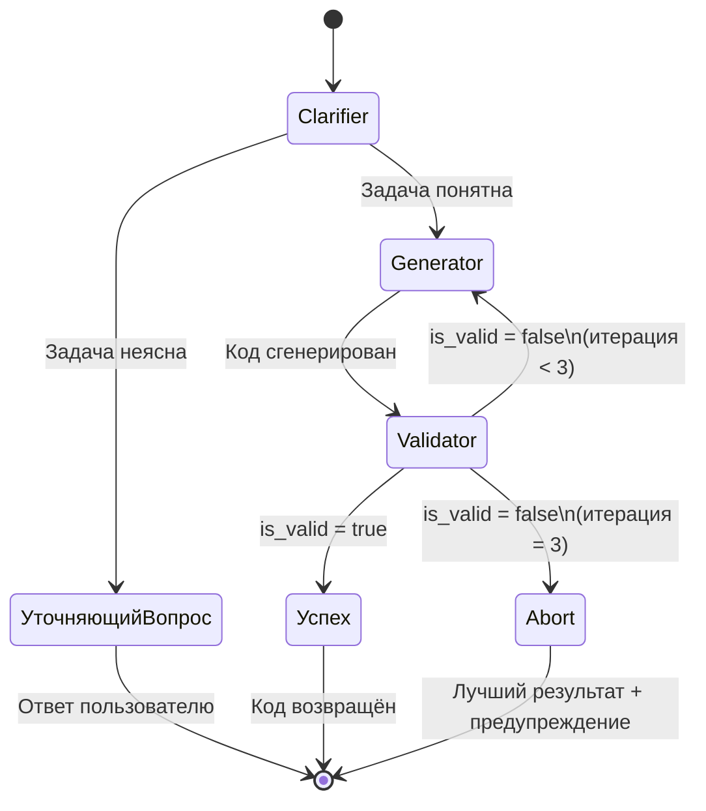
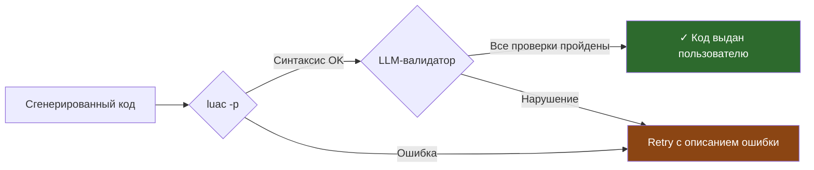
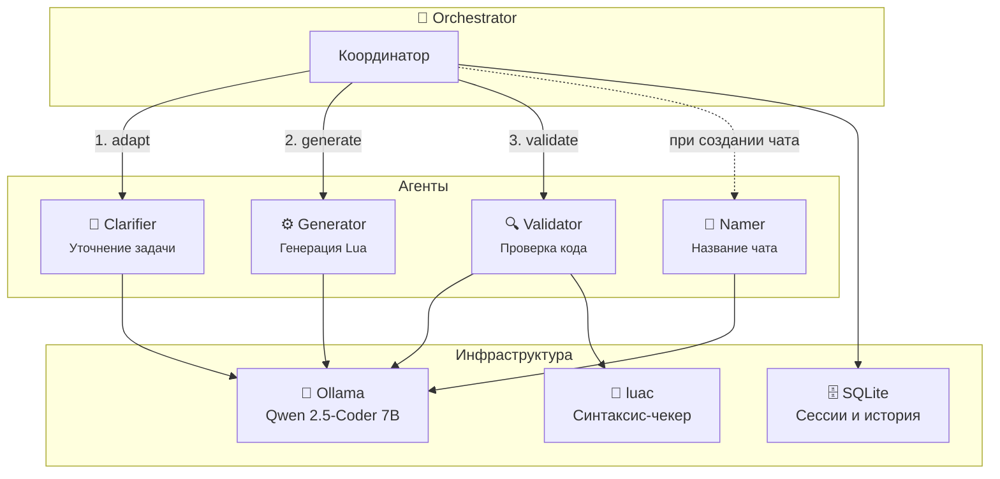
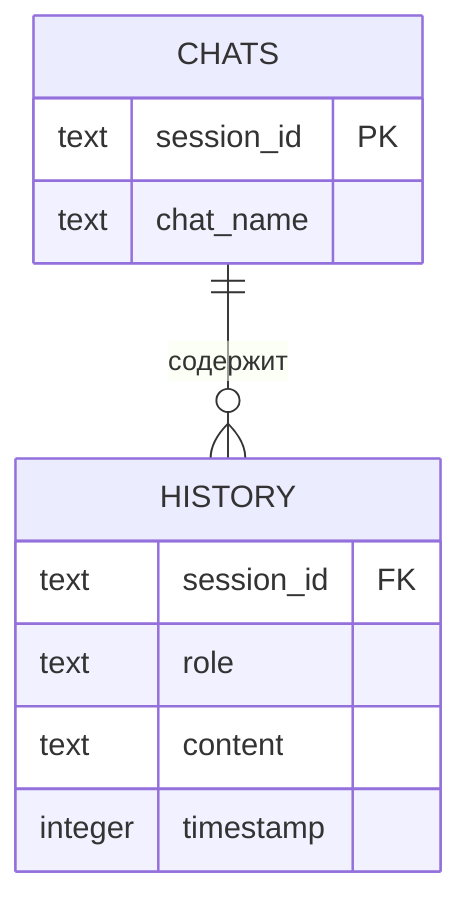

# LocalScript

**Локальная агентская система для генерации Lua-кода на платформе MTS**

Полностью офлайн-решение, которое генерирует, валидирует и итеративно улучшает Lua-код для low-code платформы MTS. Работает на локальной LLM (Qwen 2.5-Coder 7B) через Ollama — не требует интернета и укладывается в 8 ГБ VRAM.

> Проект создан на хакатоне **MTS True Tech Hack 2026**
> Команда: 2 ML-инженера + 1 Backend-разработчик

---

## Оглавление

- [Архитектура](#архитектура)
- [Как работает агентский цикл](#как-работает-агентский-цикл)
- [Агенты](#агенты)
  - [Clarifier — уточнение задачи](#clarifier--уточнение-задачи)
  - [Generator — генерация кода](#generator--генерация-кода)
  - [Validator — валидация кода](#validator--валидация-кода)
  - [Namer — именование чатов](#namer--именование-чатов)
  - [Orchestrator — координация](#orchestrator--координация)
- [API-эндпоинты](#api-эндпоинты)
- [CLI-клиент](#cli-клиент)
- [Хранение данных](#хранение-данных)
- [Стек технологий](#стек-технологий)
- [Запуск проекта](#запуск-проекта)
  - [Локально](#локально)
  - [Через Docker](#через-docker)
- [Структура проекта](#структура-проекта)

---

## Архитектура

```
                        ┌──────────────┐
                        │  Пользователь │
                        │  (Web / CLI)  │
                        └──────┬───────┘
                               │ POST /generate
                               ▼
                     ┌─────────────────────┐
                     │   FastAPI (main.py)  │
                     │   Сессии, роутинг    │
                     └─────────┬───────────┘
                               │
                ┌──────────────▼──────────────┐
                │       Orchestrator           │
                │  Координация всех агентов    │
                └──┬─────┬──────────┬─────────┘
                   │     │          │
          ┌────────▼┐ ┌──▼──────┐ ┌▼─────────┐
          │Clarifier│ │Generator│ │ Validator │
          │Уточняет │ │Генерит  │ │Проверяет  │
          │задачу   │ │Lua-код  │ │синтаксис  │
          └────┬────┘ └────┬────┘ │и логику   │
               │           │      └─────┬─────┘
               └───────────┴────────────┘
                           │
                    ┌──────▼──────┐
                    │  LLM Client │
                    │ (OpenAI SDK)│
                    └──────┬──────┘
                           │ HTTP
                    ┌──────▼──────┐       ┌────────────┐
                    │   Ollama    │       │  SQLite DB │
                    │ qwen2.5-   │       │  Сессии и  │
                    │ coder:7b   │       │  история   │
                    └─────────────┘       └────────────┘
```

---

## Жизненный цикл запроса

Sequence-диаграмма показывает полный путь запроса от пользователя до ответа:



---

## Как работает агентский цикл

При каждом запросе пользователя Orchestrator запускает следующий pipeline:

```
1. Clarifier   →  Задача понятна?
                     ├─ НЕТ → вернуть уточняющий вопрос пользователю
                     └─ ДА  → передать уточнённый промпт в Generator

2. Generator   →  Сгенерировать Lua-код

3. Validator   →  Проверить код (синтаксис + семантика)
                     ├─ Валиден     → вернуть пользователю
                     └─ Не валиден  → передать ошибки обратно в Generator
                                      (повторить до 3 раз)
```

Максимум **3 итерации** генерации-валидации. Если за 3 попытки код не прошёл проверку — возвращается лучший результат с пометкой.

### Диаграмма состояний валидации



---

## Агенты

### Clarifier — уточнение задачи

**Файл:** `src/agents/clarifier.py`

Анализирует запрос пользователя и решает, достаточно ли информации для генерации кода:
- Простые запросы (например, "выведи hello world") — пропускает сразу
- Сложные или неоднозначные запросы — задаёт уточняющие вопросы
- Учитывает историю диалога, чтобы не повторять вопросы

Возвращает:
- `status: "success"` — задача понятна, передаёт `refined_prompt` дальше
- `status: "clarification"` — возвращает вопрос пользователю

---

### Generator — генерация кода

**Файл:** `src/agents/generator.py`

Генерирует Lua-код в формате MTS-платформы:
- Оборачивает код в `jsonString lua{...}lua`
- Использует `wf.vars` для доступа к переменным
- Применяет few-shot примеры из базы знаний (`knowledge.py`)
- Парсит ответ LLM с несколькими fallback-стратегиями (JSON → Markdown → raw text)

---

### Validator — валидация кода

**Файл:** `src/agents/validator.py`

Двухэтапная проверка:

1. **Синтаксическая** — компиляция через `luac -p` (Lua-компилятор)
2. **Семантическая** — LLM проверяет по чек-листу:
   - Правильный формат обёртки `jsonString lua{...}lua`
   - Нет запрещённых вызовов (`os.*`, `io.*`, `load`)
   - Используется `wf.vars` для переменных
   - Код соответствует задаче
   - Нет потери данных

Возвращает `recommendation`: `"pass"` / `"retry"` / `"abort"`

---

### Namer — именование чатов

**Файл:** `src/agents/namer.py`

Генерирует краткое название чата (1-4 слова) на основе первого сообщения пользователя. Если LLM недоступна — возвращает "Новый диалог".

---

### Orchestrator — координация

**Файл:** `src/agents/orchestrator.py`

Главный координатор: запускает агентов в правильном порядке, обрабатывает ошибки, управляет итеративным циклом генерации-валидации. Возвращает структурированный ответ (`OrchestratorOutput`).

---

## API-эндпоинты

Сервер запускается на `http://localhost:8000`. Swagger-документация доступна по адресу `/docs`.

| Метод | Эндпоинт | Описание |
|-------|----------|----------|
| `POST` | `/generate` | Основной эндпоинт — отправить запрос на генерацию кода |
| `GET` | `/get_history/{session_id}` | Получить историю диалога по сессии |
| `GET` | `/get_sessions` | Список всех чатов |
| `GET` | `/get_current_session` | Текущая активная сессия |
| `POST` | `/create_session` | Создать новый чат |
| `POST` | `/change_session/{session_id}` | Переключиться на другой чат |
| `DELETE` | `/delete_session/{session_id}` | Удалить чат и его историю |
| `GET` | `/close_current_session` | Закрыть текущую сессию |

### Пример запроса

```bash
curl -X POST http://localhost:8000/generate \
  -H "Content-Type: application/json" \
  -d '{
    "header": {"source_agent": "user", "session_id": ""},
    "payload": {
      "raw_prompt": "Отфильтруй массив, оставь только элементы с полем Discount",
      "settings": {"target_language": "ru", "mode": "code_generation"},
      "history": []
    },
    "metadata": {"timestamp": 0}
  }'
```

---

## CLI-клиент

**Файл:** `cli/main.py`

Интерактивный консольный клиент для работы с API:

```bash
python cli/main.py
```

Возможности:
- Создание нового чата
- Выбор существующего чата
- Отправка запросов и получение сгенерированного кода
- Просмотр истории
- Удаление чатов

---

## Хранение данных

Используется **SQLite** (`data/sessions.db`), две таблицы:

| Таблица | Поля | Назначение |
|---------|------|------------|
| `history` | `session_id`, `role`, `content`, `timestamp` | Сообщения в диалогах |
| `chats` | `session_id`, `chat_name` | Метаданные чатов |

База создаётся автоматически при первом запуске.

---

## Безопасность и ограничения платформы

Генерируемый Lua-код проходит строгие проверки перед выдачей пользователю:



| Правило | Что проверяется |
|---------|----------------|
| Формат обёртки | Код обёрнут в `jsonString lua{ ... }lua` |
| Запрещённые вызовы | Нет `os.*`, `io.*`, `load`, `dofile` |
| Доступ к переменным | Только через `wf.vars` / `wf.initVariables` |
| Инициализация массивов | Через `_utils.array.new()` |
| Целостность данных | Нет потери данных при преобразованиях типов |

---

## Модель взаимодействия агентов



---

## Схема данных



---

## Стек технологий

| Компонент | Технология |
|-----------|-----------|
| Backend | FastAPI + Uvicorn |
| LLM | Qwen 2.5-Coder 7B через Ollama |
| LLM SDK | OpenAI Python SDK (Ollama-совместимый API) |
| Валидация данных | Pydantic v2 |
| База данных | SQLite3 |
| Проверка синтаксиса | luac (Lua 5.4) |
| Контейнеризация | Docker + Docker Compose |
| Язык | Python 3.11 |

### Параметры LLM

| Параметр | Значение |
|----------|----------|
| Модель | `qwen2.5-coder:7b` |
| Контекстное окно | 4096 токенов |
| Макс. выход | 2048 токенов |
| Temperature | 0.1 |
| Top-K / Top-P | 40 / 0.9 |
| Таймаут | 300 сек |
| VRAM | 8 ГБ |

---

## Запуск проекта

### Предварительно

1. Установить [Ollama](https://ollama.com/download)
2. Скачать модель:
   ```bash
   ollama pull qwen2.5-coder:7b
   ```
3. Запустить Ollama:
   ```bash
   ollama serve
   ```

---

### Локально

```bash
# Создать виртуальное окружение
python -m venv venv
source venv/bin/activate

# Установить зависимости
pip install -r requirements.txt

# Запустить сервер
uvicorn src.api.main:app --host 0.0.0.0 --port 8000 --reload
```

Открыть Swagger UI: [http://localhost:8000/docs](http://localhost:8000/docs)

---

### Через Docker

```bash
# Убедиться, что Ollama запущена на хосте
ollama serve

# Собрать и запустить
docker-compose up --build

# Или в фоновом режиме
docker-compose up --build -d

# Остановить
docker-compose down
```

Открыть Swagger UI: [http://localhost:8000/docs](http://localhost:8000/docs)

---

## Структура проекта

```
MTS-True-Tech-Hack/
├── src/
│   ├── api/
│   │   ├── main.py              # FastAPI-приложение и эндпоинты
│   │   ├── config.py            # Конфигурация (модель, параметры)
│   │   ├── llm_client.py        # Клиент для Ollama
│   │   └── knowledge.py         # База знаний MTS-платформы
│   │
│   ├── agents/
│   │   ├── orchestrator.py      # Координатор агентов
│   │   ├── generator.py         # Генерация Lua-кода
│   │   ├── validator.py         # Валидация кода
│   │   ├── clarifier.py         # Уточнение задачи
│   │   ├── namer.py             # Именование чатов
│   │   ├── prompts/             # Системные промпты агентов
│   │   └── contracts/           # Pydantic-модели данных
│   │
│   └── db/
│       └── history_db.py        # SQLite-хранилище сессий
│
├── cli/
│   └── main.py                  # Консольный клиент
│
├── docs/                        # Документация и схемы
├── data/                        # SQLite БД (создаётся автоматически)
├── Dockerfile
├── docker-compose.yml
├── requirements.txt
├── .dockerignore
├── Instruction.md               # Подробная инструкция по установке
└── README.md
```

---

## Формат обмена данными

Все агенты обмениваются данными через единый контракт:

```
┌─────────────────────────────────────────────┐
│                AgentOutput                  │
├─────────────────────────────────────────────┤
│  header                                     │
│  ├── source_agent: "generator"              │
│  ├── timestamp: 1713168000                  │
│  └── status: "success" | "error"            │
├─────────────────────────────────────────────┤
│  payload                                    │
│  ├── content: "jsonString lua{...}lua"      │
│  ├── explanation: "Код фильтрует массив..." │
│  └── language: "lua"                        │
├─────────────────────────────────────────────┤
│  metadata                                   │
│  ├── model: "qwen2.5-coder:7b"             │
│  └── usage                                  │
│      ├── total_tokens: 1024                 │
│      └── duration_ms: 3200                  │
├─────────────────────────────────────────────┤
│  error: null | "описание ошибки"            │
└─────────────────────────────────────────────┘
```

Каждый агент (Clarifier, Generator, Validator, Namer) имеет свою специализацию payload, но общая структура `Header + Payload + Metadata + Error` едина для всех — это упрощает отладку и расширение системы.
