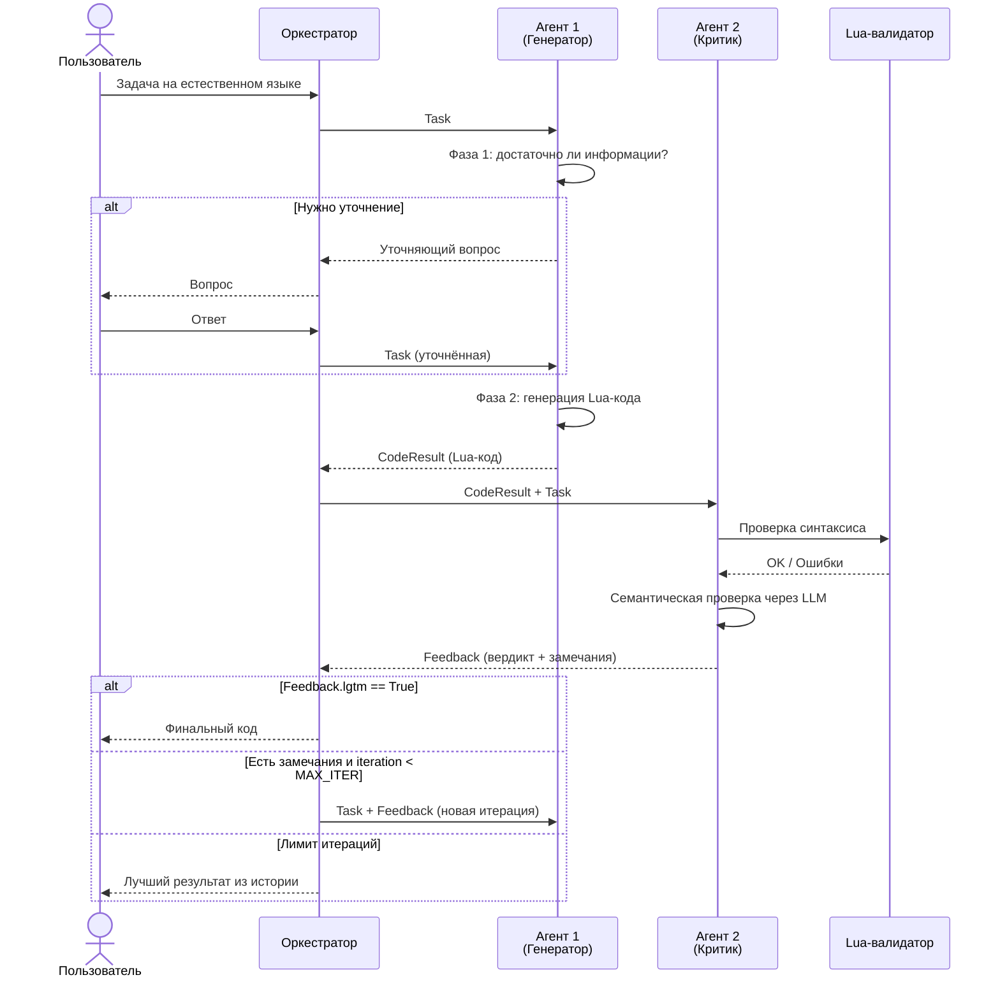
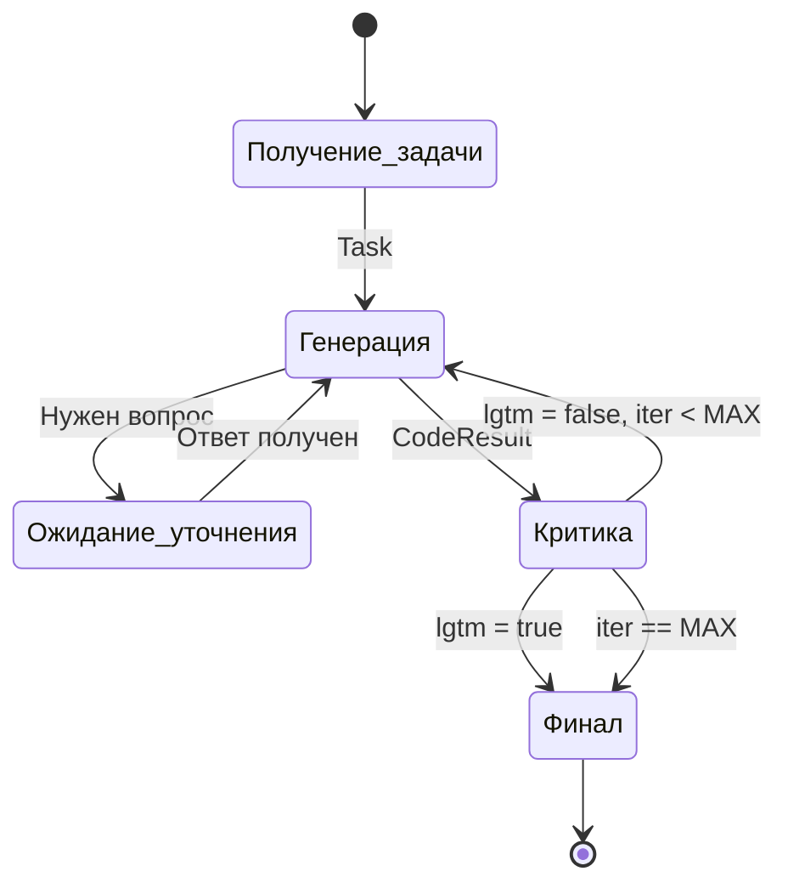
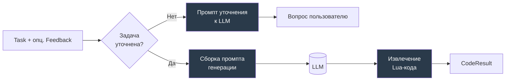
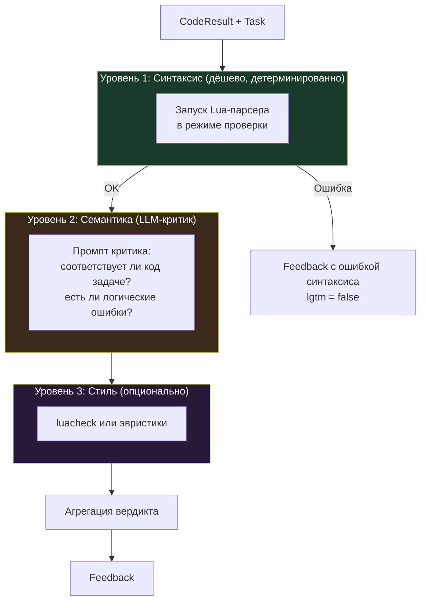

> Локальная агентская система для генерации Lua-кода
> Команда: **2 ML-инженера + 1 Backend-разработчик**
> Стек: Python + Ollama (`qwen2.5-coder:7b`) + FastAPI + Docker

---

## Состав команды и зоны ответственности

| Роль | Кто | Основная зона |
|---|---|---|
| **ML-1 (Генератор)** | ML-инженер №1 | Агент 1: планирование, уточнение, генерация Lua, промпт-инжиниринг |
| **ML-2 (Критик)** | ML-инженер №2 | Агент 2: валидация, семантическая критика, промпты критика, тестирование на публичной выборке |
| **BE (Инфраструктура)** | Backend-разработчик | Оркестратор, LLM-клиент, FastAPI, Docker, CI, контракты данных |

Такое разделение не жёсткое — BE помогает обоим ML с интеграцией, а ML-1 и ML-2 регулярно синхронизируются по общему формату обмена данными. Но каждый этап имеет **ответственного**, чтобы не было «ничейных» задач.

---

## Общая архитектура системы

Ниже — контекстная диаграмма того, как система выглядит снаружи и как устроена внутри.


**Ключевые принципы:**
- Всё работает локально, никаких внешних API в runtime.
- Единственная точка общения с LLM — `LLM-клиент`, через него проходят оба агента.
- Оркестратор ничего не знает о промптах и о Lua — он только гоняет данные по циклу.
- Агенты не общаются напрямую — только через оркестратор и общие структуры данных.

---

## Цикл работы двух агентов

Это сердце системы — то, за что дают баллы по критерию «Агентность и качество итераций».



Цикл «Генератор → Критик → Генератор» — это то, что превращает обычный code-completion в настоящую агентную систему. Пользователь не получает первый попавшийся ответ модели, а наблюдает **управляемый процесс улучшения**.

---

# Этапы разработки

## Этап 0 — Подготовка окружения и фундамента

**Ответственный:** BE | **Параллельно:** ML-1, ML-2 поднимают Ollama локально | **Длительность:** ~4 часа

### Зачем этот этап

Прежде чем писать код, нужно зафиксировать железо и инструменты. Это важно потому, что задача жёстко ограничивает ресурсы (8 ГБ VRAM, GPU-only, фиксированные параметры Ollama), и любая ошибка на старте потом аукнется на демо.

### Что происходит

BE готовит структуру репозитория: отдельные папки для агентов, оркестратора, API, конфигов и тестов. Такая структура потом сильно упростит и ревью, и построение C4-диаграммы. Здесь же создаётся файл конфигурации — **один источник истины**, откуда и оркестратор, и агенты, и LLM-клиент будут брать параметры модели, лимиты итераций, пути.

Параллельно **оба ML-инженера** ставят Ollama на свои машины, скачивают `qwen2.5-coder:7b` и проверяют, что модель действительно помещается в VRAM с заданными параметрами `num_ctx=4096`, `num_predict=256`. Это не формальность — если модель не влезет или пойдёт CPU offload, жюри отклонит решение. Замер делается через `nvidia-smi` в режиме пикового потребления.

### Результат этапа

Работающее окружение у всех троих, скелет репозитория, единый конфиг, подтверждение что модель укладывается в лимит 8 ГБ VRAM.

---

## Этап 1 — Контракты данных между компонентами

**Ответственный:** BE совместно с ML-1 и ML-2 | **Длительность:** ~3 часа

### Зачем этот этап

Перед тем как писать логику, нужно договориться, **какими объектами агенты обмениваются между собой**. Это ключевой момент архитектуры двух агентов: если контракты размыты, команда будет постоянно переписывать интерфейсы и наступать друг другу на ноги. Поскольку три человека работают параллельно, этот этап экономит часы на интеграции.

### Что происходит

Команда собирается вместе (буквально на 30 минут за одним столом) и описывает три основные сущности:

- **Task** — исходный запрос пользователя, флаг «уточнена ли задача», история уточнений, номер текущей итерации.
- **CodeResult** — то, что возвращает Агент-генератор: сам Lua-код, метаданные (номер итерации, использованный промпт), флаг успешного извлечения кода из ответа модели.
- **Feedback** — то, что возвращает Агент-критик: вердикт (`lgtm: bool`), список замечаний, результаты синтаксической проверки, сырой ответ LLM-критика.

Смысл этого этапа — сделать так, чтобы ML-1 мог писать Генератор, ML-2 писал Критика, а BE — Оркестратор, **параллельно и не мешая друг другу**. Как только контракты зафиксированы, каждый работает со своими моками и тестами.

### Результат этапа

Модуль с дата-классами/Pydantic-моделями, который все трое импортируют. Документ-памятка с описанием каждого поля.

---

## Этап 2 — LLM-клиент как единственная точка входа к модели

**Ответственный:** BE | **Длительность:** ~4 часа

### Зачем этот этап

Весь код, который общается с Ollama, должен жить в одном месте. Это даёт сразу несколько выгод: можно в одном месте логировать все промпты и ответы (пригодится для демо-видео и отладки), можно подменить модель одной строчкой в конфиге, и гарантируется что параметры запуска (`num_ctx`, `num_predict`, `batch`, `parallel`) везде одинаковы.

### Что происходит

BE пишет модуль-обёртку над Ollama API. Модуль принимает системный промпт, пользовательское сообщение, возвращает ответ модели. Внутри — обработка таймаутов, повторные попытки при сетевых ошибках, логирование всех запросов-ответов в файл (это пригодится ML-инженерам для отладки промптов).

Ещё на этом этапе BE продумывает **деградацию**: что делать если Ollama не отвечает, если модель вернула пустой ответ, если превышен таймаут. Система должна падать красиво, а не стектрейсом перед жюри.

### Результат этапа

Готовый LLM-клиент, который ML-инженеры могут сразу использовать в своих агентах. Файл логов со всеми запросами.

---

## Этап 3 — Оркестратор как дирижёр

**Ответственный:** BE | **Длительность:** ~6 часов

### Зачем этот этап

Оркестратор — это сердце системы, и его нужно реализовывать **раньше агентов**, даже с заглушками. Парадоксально, но так команда быстрее получит рабочий end-to-end скелет, в который ML-инженеры потом вставят настоящих агентов.

### Что происходит

BE реализует логику оркестратора: получить задачу → передать Генератору → получить код → передать Критику → получить вердикт. Если Критик доволен — отдать результат пользователю. Если нет — добавить замечания в контекст и запустить Генератор ещё раз. И так до максимального числа итераций (обычно 3).



Важная деталь: оркестратор должен **хранить историю всех итераций**, а не только последнюю. Во-первых, это нужно чтобы вернуть «лучший из» если лимит исчерпан. Во-вторых — именно эта история делает решение «агентным», за что дают баллы.

На этапе разработки оркестратора агенты ещё не готовы — BE использует **моки** Агента 1 и Агента 2 (заглушки, возвращающие фиктивные данные по контрактам из Этапа 1). Это позволяет сразу гонять оркестратор через тесты и проверять логику ветвления.

### Результат этапа

Работающий оркестратор с моками агентов, проходящий end-to-end тест: задача → моковый код → моковая критика → финал.

---

## Этап 4 — Агент 1: Генератор в двух фазах

**Ответственный:** ML-1 | **Длительность:** ~10 часов

### Зачем этот этап

Генератор — не просто обёртка «текст на вход → код на выход». Он состоит из двух фаз, и это принципиально для получения баллов за агентность.

### Что происходит

**Фаза 1 — планирование и уточнение.** Агент получает задачу и сначала задаёт себе вопрос: «достаточно ли здесь информации, чтобы написать рабочий Lua-код?». Для этого используется отдельный промпт к LLM, который просит модель либо сказать «задача понятна», либо задать ровно один уточняющий вопрос пользователю. Именно эта фаза — главный источник баллов за агентность: система не штампует слепо код, а ведёт диалог.

**Фаза 2 — собственно генерация.** Здесь собирается итоговый промпт: системная часть («ты Lua-разработчик, пиши только рабочий код, оборачивай его в блок»), пользовательская задача, и — если это не первая итерация — замечания от Критика с предыдущей попытки. Модель вызывается, ответ возвращается.

Отдельная маленькая, но важная часть — **извлечение кода** из ответа модели. LLM иногда обрамляет код в markdown-блок, иногда пишет пояснения до и после, иногда забывает разметку. Нужен простой парсер, который вытащит чистый Lua. Если извлечь не удалось — это не ошибка, а сигнал: в следующей итерации в промпт добавляется напоминание про формат.



ML-1 параллельно ведёт **журнал промптов**: какая формулировка даёт какой результат на тестовой задаче. Это критически важно — 80% качества Генератора зависит от качества промптов, а не от кода вокруг них.

### Результат этапа

Работающий Агент 1, который умеет задавать уточняющие вопросы и генерировать Lua-код по задаче. Журнал экспериментов с промптами.

---

## Этап 5 — Агент 2: Критик с многоуровневой проверкой

**Ответственный:** ML-2 | **Длительность:** ~10 часов

### Зачем этот этап

Критик — второй столп агентности и главный источник баллов за качество кода. Его задача — **не просто сказать «ок/не ок», а дать Генератору конкретный структурированный фидбек**, который тот сможет использовать на следующей итерации.

### Что происходит

Критик проверяет код на нескольких уровнях. Порядок важен: от дешёвых и детерминированных проверок к дорогим и вероятностным.



**Уровень 1 — синтаксическая валидация.** Это самый важный и самый дешёвый уровень. ML-2 запускает Lua-интерпретатор в режиме проверки синтаксиса (без выполнения) на сгенерированном коде. Если интерпретатор ругается — критик сразу получает конкретную ошибку с номером строки, это готовый фидбек для Генератора. Этот уровень **обязателен**, потому что именно он закрывает требование задачи «генерация + валидация».

**Уровень 2 — семантическая проверка через LLM.** Критик — тоже агент на LLM, но с другим промптом: «вот задача пользователя, вот сгенерированный код, проверь соответствует ли код задаче, есть ли логические ошибки, обработаны ли граничные случаи». Важно, чтобы промпт просил **структурированный ответ** (вердикт + список замечаний), иначе оркестратор не сможет его нормально разобрать. ML-2 здесь придётся повозиться с форматом — возможно, попросить модель отвечать в JSON.

**Уровень 3 — статический анализ (опционально).** Если останется время, ML-2 добавляет проверку стиля через luacheck. Это даст дополнительные баллы, но не критично для MVP.

Критик собирает всё в объект `Feedback` и возвращает оркестратору.

### Результат этапа

Работающий Агент 2 с двумя уровнями проверки минимум. Примеры Feedback на плохих и хороших кусках кода.

---

## Этап 6 — Интерфейс пользователя и API

**Ответственный:** BE | **Длительность:** ~6 часов

### Зачем этот этап

Задача требует, чтобы пользователь мог как-то взаимодействовать с системой. Из Q&A ясно, что интерфейс оценивается во вторую очередь — главное полезность функций — но он должен быть, и именно через него снимается демо-видео.

### Что происходит

BE поднимает FastAPI с несколькими эндпоинтами: принять задачу, отправить ответ на уточняющий вопрос, получить статус генерации, получить финальный результат. К API прикладывается простая HTML-страница с формой ввода и областью вывода — никакого фронтенда на React, просто ванильный JS.

Преимущество веб-интерфейса в том, что на нём красиво видно **процесс итераций**: пользователь ввёл задачу → система задала уточняющий вопрос → получила ответ → сгенерировала код → Критик нашёл проблему → перегенерировала → показала финальный результат. Этот процесс — главный козырь на защите.

Минимум — CLI как резервный вариант (на случай если веб не успеют или он сломается прямо перед демо). CLI делается за час поверх того же оркестратора.

### Результат этапа

Работающий веб-интерфейс и CLI. Оба используют один и тот же оркестратор.

---

## Этап 7 — Интеграция и сквозной прогон

**Ответственный:** вся команда | **Длительность:** ~4 часа

### Зачем этот этап

До этого момента каждый работал более-менее изолированно: BE с моками, ML-1 со своим агентом, ML-2 со своим. Теперь всё собирается вместе, и **обязательно что-то сломается**. Под это нужно заложить отдельный блок времени, а не надеяться что «само склеится».

### Что происходит

Команда собирается, подключает настоящих агентов вместо моков в оркестраторе, и гоняет систему на нескольких тестовых задачах. Обычно всплывает: несоответствия в контрактах данных (кто-то поменял поле, не сказав), слишком долгие промпты (модель отвечает 30 секунд вместо 5), Критик слишком строгий и система зацикливается на итерациях, Генератор игнорирует фидбек от Критика.

Здесь же крутится первый **end-to-end тест на реальном железе**: полный цикл от формы в браузере до финального Lua-кода.

### Результат этапа

Работающая система целиком, список найденных багов, распределение фиксов по ролям.

---

## Этап 8 — Тестирование на публичной выборке и тюнинг промптов

**Ответственный:** ML-2 ведёт, ML-1 фиксит промпты | **Длительность:** ~8 часов

### Зачем этот этап

Организаторы дали публичную выборку типовых запросов (`Публичная выборка LocalScript.pdf`). Это главная тестовая база, максимально близкая к тому, на чём жюри будут проверять решение. Прогон через эту выборку — **единственный способ** оценить реальное качество до защиты.

### Что происходит

ML-2 берёт все запросы из публичной выборки и прогоняет их через систему. Результаты сводятся в таблицу: задача, сгенерированный код, прошёл ли синтаксис, вердикт критика, соответствует ли ожидаемому выводу. Смотрим честно: где код рабочий, где синтаксис проходит но логика неверная, где Критик не заметил проблему, где Генератор зациклился.

На основе этого прогона ML-1 **доводит промпты Генератора**, ML-2 — **промпты Критика**. Это самая недооценённая часть работы над LLM-системами — львиная доля итогового качества зависит именно от шлифовки промптов. Закладывайте на эту итеративную работу как минимум четверть всего времени хакатона.

Отдельно стоит проверить, как qwen2.5-coder пишет именно **Lua** — это не самый популярный язык в обучающих данных моделей. Возможно, в системный промпт придётся добавить короткие примеры хорошего Lua-кода (few-shot), чтобы поднять качество.

### Результат этапа

Таблица результатов по публичной выборке с процентом успеха. Финальные версии промптов обоих агентов.

---

## Этап 9 — Docker и воспроизводимость

**Ответственный:** BE | **Длительность:** ~5 часов

### Зачем этот этап

Жюри прямо написали: «в случае проблем с запуском решение дальше рассматриваться не будет». Это значит, что плохо упакованный Docker может обнулить все ваши усилия по качеству. Этот этап критичен.

### Что происходит

BE готовит `docker-compose`, который одной командой поднимает всё: контейнер с приложением и контейнер с Ollama. Nuance: Ollama с GPU требует проброса NVIDIA-рантайма в Docker — это нужно описать в README с конкретными шагами для жюри.

В README должны быть:

- Точная команда `ollama pull` с правильным тегом модели (`qwen2.5-coder:7b`) и объяснением почему выбран именно этот тег.
- Требования к железу (CUDA, драйвера, 8 ГБ VRAM минимум).
- **Одна команда** запуска всей системы.
- Как потестить (примеры запросов из публичной выборки).
- Краткое описание архитектуры со ссылкой на C4-диаграмму.

### Результат этапа

`docker-compose.yml`, `Dockerfile`, готовый README с инструкцией. Проверка на чистой машине, если возможно — на машине одного из ML, где ещё нет окружения.

---

## Этап 10 — C4-диаграмма архитектуры

**Ответственный:** BE | **Длительность:** ~3 часа

### Зачем этот этап

Это отдельный артефакт, который сдаётся в задаче 3 как отдельный файл. C4 — нотация с несколькими уровнями вложенности. Для LocalScript достаточно двух-трёх уровней.

### Что происходит

BE рисует три уровня:

**Уровень 1 (Context)** — одна картинка: «Пользователь» взаимодействует с системой «LocalScript», которая внутри использует локальную LLM. Никаких внешних сервисов — это нужно показать явно, потому что локальность — один из критериев оценки.

**Уровень 2 (Containers)** — контейнеры: веб/CLI интерфейс, основное приложение на Python, контейнер Ollama. Стрелки между ними с подписями какой протокол (HTTP).

**Уровень 3 (Components)** — внутренности основного приложения: Оркестратор, Агент-Генератор, Агент-Критик, LLM-клиент, Lua-валидатор. Стрелки показывают поток данных по циклу итераций.

Диаграммы рисуются в Structurizr, draw.io или PlantUML с C4-расширением. Главное — чтобы на всех трёх уровнях была видна **локальность** и **цикл между двумя агентами** через оркестратор.

### Результат этапа

PDF или PNG файл с тремя диаграммами для сдачи в задачу 3.

---

## Этап 11 — Демо-видео

**Ответственный:** ML-1 (как автор Генератора, лучше понимает сценарии) | **Длительность:** ~3 часа

### Зачем этот этап

Демо-видео — это то, что жюри увидят до презентации. Оно должно убедить их, что решение **действительно работает и действительно агентное**.

### Что происходит

ML-1 готовит **один-два впечатляющих сценария end-to-end**. Не весь функционал подряд — а конкретные истории, показывающие силу системы:

1. **Сценарий с уточнением:** пользователь даёт расплывчатую задачу → агент задаёт уточняющий вопрос → пользователь отвечает → система генерирует корректный код.
2. **Сценарий с исправлением:** пользователь даёт задачу → Генератор выдаёт код с ошибкой → Критик её ловит → Генератор исправляет → финальный код работает.

Это ровно тот нарратив, за который дают максимум баллов по критерию «Агентность и качество итераций».

Видео записывается на одном дубле с комментариями за кадром. Длина — 2-4 минуты, не больше. Жюри не будут смотреть 10-минутное видео.

### Результат этапа

MP4-файл готового демо-видео.

---

## Этап 12 — Презентация

**Ответственный:** ML-2 ведёт структуру, вся команда правит | **Длительность:** ~5 часов

### Зачем этот этап

Презентация (PDF до 15 слайдов, до 20 МБ) должна явно закрывать три критерия оценки. Если презентация не отвечает на вопрос жюри «где тут баллы», баллы не ставят, даже если решение хорошее.

### Что происходит

Структура слайдов привязана к критериям оценки:

1. **Титульный + команда** (1 слайд)
2. **Проблема** (1 слайд) — локальность, приватность, почему внешние API не подходят.
3. **Решение в одном слайде** (1 слайд) — что мы сделали в двух предложениях.
4. **Архитектура** (2-3 слайда) — C4-диаграммы, акцент на два агента.
5. **Качество кода** — критерий 1 на 50 баллов (2-3 слайда) — примеры сгенерированного кода, результаты прогона по публичной выборке.
6. **Агентность и итерации** — критерий 2 на 25 баллов (2-3 слайда) — сценарий с уточнением, сценарий с исправлением, скриншоты цикла.
7. **Локальность и воспроизводимость** — критерий 3 на 25 баллов (2 слайда) — стек, одна команда запуска, замеры VRAM через nvidia-smi.
8. **Итоги и следующие шаги** (1 слайд).

На каждый критерий — **конкретные доказательства**: не «наш код качественный», а «85% задач из публичной выборки прошли синтаксическую валидацию с первой попытки».

### Результат этапа

PDF-презентация для сдачи в задачу 4.

---

# Временная раскладка и параллелизм

```mermaid
gantt
    title План работ (в часах с начала хакатона)
    dateFormat X
    axisFormat %H ч

    section Общее
    Этап 0: Окружение           :done, e0, 0, 4
    Этап 1: Контракты данных    :done, e1, 4, 7

    section Backend
    Этап 2: LLM-клиент          :be2, after e1, 4h
    Этап 3: Оркестратор (моки)  :be3, after be2, 6h
    Этап 6: API и UI            :be6, after be3, 6h
    Этап 9: Docker              :be9, 40, 5h
    Этап 10: C4-диаграммы       :be10, 45, 3h

    section ML-1 Генератор
    Этап 4: Агент 1             :ml1, after e1, 10h
    Тюнинг промптов Ген.        :ml1t, 32, 8h
    Этап 11: Демо-видео         :ml1v, 48, 3h

    section ML-2 Критик
    Этап 5: Агент 2             :ml2, after e1, 10h
    Этап 8: Публичная выборка   :ml2p, 32, 8h
    Этап 12: Презентация        :ml2pr, 48, 5h

    section Синхронизация
    Этап 7: Интеграция          :crit, sync, 28, 4h
```

**Ключевые точки синхронизации:**

- После Этапа 1 все трое расходятся работать параллельно — это возможно благодаря зафиксированным контрактам.
- Этап 7 (Интеграция) — обязательная точка сбора всей команды. Без неё Этап 8 не стартует.
- Этап 8 (тюнинг) и Этап 9 (Docker) идут параллельно: пока ML доводят промпты, BE упаковывает решение.
- Последние 8 часов — только презентация, демо-видео, финальная шлифовка. Никакого нового кода.

---

# Критические риски и как их смягчать

| Риск | Вероятность | Митигация |
|---|---|---|
| Модель не влезает в 8 ГБ VRAM | Средняя | Проверить на Этапе 0, иметь запасной вариант с квантизацией |
| `qwen2.5-coder` плохо пишет Lua | Высокая | Few-shot в промпте на Этапе 4, раннее тестирование на публичной выборке |
| Медленный инференс (минута на задачу) | Высокая | Уменьшить `num_predict`, ограничить итерации, показывать прогресс в UI |
| Докер не собирается перед демо | Средняя | Собрать Docker на Этапе 9 и больше не трогать его; иметь CLI как fallback |
| Критик слишком строг, система зацикливается | Средняя | Жёсткий лимит итераций в оркестраторе; логировать зацикливания на Этапе 7 |
| Несогласованность контрактов между агентами | Средняя | Этап 1 как отдельный артефакт; код-ревью на Этапе 7 |
| Кто-то из команды выпадает | Низкая | Контракты данных позволяют подхватить чужой кусок; BE знает логику всех компонентов |

---

# Что каждый делает в итоге

**ML-1 (Генератор):** Агент 1 с двумя фазами, промпт-инжиниринг для генерации Lua, тюнинг на публичной выборке (в части своего агента), демо-видео.

**ML-2 (Критик):** Агент 2 со всеми уровнями проверки, промпт-инжиниринг для критики, прогон публичной выборки, презентация.

**BE (Инфраструктура):** Контракты данных, LLM-клиент, оркестратор, API, веб-интерфейс, Docker, C4-диаграммы.

**Вся команда:** Этап 1 (контракты), Этап 7 (интеграция), финальная шлифовка.


